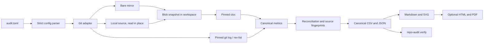

# Deterministic Repository Audit

[](https://github.com/OBaruch/deterministic_repository_analysis/actions/workflows/ci.yml)
[](LICENSE)


**Reproducible, read-only, evidence-producing quantitative audits of Git repositories, safe to run by hand, in CI, or through AI coding agents.**

The toolkit turns any set of Git repositories into exact facts: tracked and source files, lines of code per file and language, unique commits, and developer activity by day, ISO week, and month. Every figure comes from Git and a pinned LOC tool, every aggregate is reconciled programmatically, and the results can be re-verified independently. Analyzed repositories are never modified.

GitHub Copilot, Claude Code, and Codex integrations orchestrate the same CLI. Agents run it, check it, and report its output. **They never calculate a number.**

## Highlights

- **Deterministic.** Identical inputs produce byte-identical CSV, JSON, Markdown, and SVG outputs. Refs can be pinned to commit SHAs, and the LOC tool to a version and SHA-256.
- **Read-only by construction.** Remote sources become bare mirrors in an external workspace; local sources are read in place. Before/after fingerprints of every source's status and refs are part of each run.
- **Content-exact.** Files are materialized from raw Git blobs, so `.gitattributes`, end-of-line conversion, LFS filters, and archive rules cannot change what is measured.
- **Self-verifying.** Each run records reconciliation checks in `validation.csv`, and `repo-audit verify` recomputes every derived table from canonical data.
- **Explicit.** Developer identities, aliases, exclusions, and history scope are configuration, never heuristics.
- **Agent-ready.** One shared Agent Skill, three host adapters, and a host-agnostic read-only guard that blocks mutating Git commands and edits to protected paths.
- **Dependency-free runtime.** Python 3.11+ standard library, Git, and cloc. Linux, macOS, and Windows.

## How it works



## Requirements

- Python 3.11 or newer
- Git
- [cloc](https://github.com/AlDanial/cloc), or network access once to run `repo-audit bootstrap-cloc` (Perl is required on Linux and macOS)
- Optional: Microsoft Edge, Google Chrome, or Chromium for PDF output

## Quick start

```console
git clone https://github.com/OBaruch/deterministic_repository_analysis.git
cd deterministic_repository_analysis
python -m venv .venv
```

Activate the environment (`.venv\Scripts\Activate.ps1` on Windows PowerShell, `source .venv/bin/activate` elsewhere), then install the CLI and a verified LOC tool:

```console
python -m pip install -e .
repo-audit bootstrap-cloc
repo-audit init audit.toml
```

Copy the command and SHA-256 printed by `bootstrap-cloc` into the `[loc]` table, list your repositories, and keep `output_dir` and `workspace_dir` outside every analyzed repository. Then:

```console
repo-audit validate-config --config audit.toml
repo-audit audit --config audit.toml
repo-audit verify --config audit.toml
```

Add `--pdf` to `audit` for an HTML and PDF report. `--force` replaces a previous output only if it carries the toolkit's marker file; it never deletes arbitrary directories.

## Configuration

```toml
schema_version = 1
title = "Engineering Repository Audit"
output_dir = "../repo-audit-output"
workspace_dir = "../repo-audit-workspace"
generate_pdf = false
require_clean = true
history_scope = "branches-and-tags"   # or "all-refs"

[loc]
command = ["perl", "/path/to/.repo-audit-tools/cloc-2.10.pl"]
expected_version = "2.10"
expected_sha256 = "bf59272455172108072a0a106379f7509fd4349bdcfd85203bac038ccd286d83"

[developer]
exclude_patterns = []      # regular expressions matched against "Name <email>"

[developer.aliases]
# "Alias Name <alias@example.com>" = "Canonical Name <canonical@example.com>"

[[repositories]]
name = "service-a"
url = "https://git.example.com/example-org/service-a.git"
ref = "main"
expected_sha = ""          # pin after the first run
fetch = true

[[repositories]]
name = "local-library"
path = "../local-library"
ref = "HEAD"
fetch = false
```

The first run records every resolved SHA in `repository_summary.csv` and `metadata.json`. Copy them into `expected_sha` for controlled repeat runs. See [docs/USAGE.md](docs/USAGE.md) for every option.

## Outputs

| Category | Files |
| --- | --- |
| Snapshot facts | `repository_summary.csv`, `files.csv`, `languages.csv`, `excluded_files.csv` |
| History facts | `commits.csv`, `developer_summary.csv`, `developer_daily.csv`, `developer_weekly.csv`, `developer_monthly.csv`, `excluded_authors.csv` |
| Global views | `global_languages.csv`, `repository_percentages.csv`, `top_20_files.csv`, `developer_global_summary.csv` |
| Evidence | `validation.csv`, `metadata.json`, `audit-data.json`, `raw/` (LOC tool input and report) |
| Reports | `REPORT.md`, `METHODOLOGY.md`, `reports/`, `charts/`, optional `repo-audit-report.html` and `.pdf` |

Exit codes are `0` for success, `1` for an audit or verification failure, and `2` for a usage or configuration error. Outputs can contain private URLs, paths, names, and email addresses: they are git-ignored by default and must never be committed to this repository.

## Using AI agents

| Host | Entry point | Assets |
| --- | --- | --- |
| GitHub Copilot (VS Code) | Select **Repository Auditor** or run `/Audit Repositories` | `.github/agents/`, `.github/prompts/`, `.github/hooks/`, `.agents/skills/` |
| Claude Code | `claude --agent repository-auditor`, or invoke `/repository-audit` | `.claude/agents/`, `.claude/skills/`, `.claude/settings.json`, `CLAUDE.md` |
| Codex | `$repository-audit`, or ask for `repository_auditor` | `.codex/agents/`, `.codex/hooks.json`, `.agents/skills/`, `AGENTS.md` |

Each host gets the same three roles: an orchestrator, a read-only preflight agent, and a read-only validator that runs `repo-audit verify`. Launch your agent from the activated virtual environment so that `python` and `repo-audit` resolve to the toolkit. Details, prerequisites, and host-specific notes are in [docs/AGENTIC-SYSTEM.md](docs/AGENTIC-SYSTEM.md).

## AI-native development

This project is built with an AI-native software development lifecycle. Three documents are the source of truth for people and agents alike:

| Document | Answers |
| --- | --- |
| [intent.md](intent.md) | Why the toolkit exists, who it serves, its principles, non-goals, and responsible-use boundaries |
| [specs.md](specs.md) | What it must do: numbered requirements, data contracts, validation catalog, acceptance scenarios, traceability |
| [plan.md](plan.md) | How it is built: delivery workflow, decision log, milestones, risks, and definition of done |

Behavior changes start in `specs.md`, decisions are recorded in `plan.md`, and tests trace back to requirement IDs. [AGENTS.md](AGENTS.md) tells coding agents how to work within this loop.

## Scope and responsible use

The toolkit reports observed repository facts. It intentionally does not estimate effort, cost, duration, staffing, productivity, or delivery dates, and it does not rank people. Lines of code and commit counts describe artifacts, not individual performance. Read [intent.md](intent.md#responsible-use) before sharing developer-level outputs.

## Documentation

- [Usage](docs/USAGE.md): commands, configuration reference, reproducible runs, troubleshooting
- [Methodology](docs/METHODOLOGY.md): exact definitions of every metric
- [Architecture](docs/ARCHITECTURE.md): modules, data flow, trust boundaries
- [Agentic system](docs/AGENTIC-SYSTEM.md): skills, agents, hooks, and the read-only guard
- [Organization rollout](docs/ORGANIZATION-ROLLOUT.md): distribution and governance
- [Changelog](CHANGELOG.md)

## Contributing and security

Contributions are welcome. Read [CONTRIBUTING.md](CONTRIBUTING.md) and the [Code of Conduct](CODE_OF_CONDUCT.md). Report vulnerabilities privately as described in [SECURITY.md](SECURITY.md).

## License

Licensed under the [Apache License, Version 2.0](LICENSE). See [NOTICE](NOTICE) for attribution and third-party information. cloc is not distributed with this project; `repo-audit bootstrap-cloc` downloads the official release, which is licensed under the GNU General Public License.
