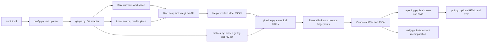

# Architecture

The design decisions behind this architecture are recorded in the decision log of [plan.md](../plan.md#3-decision-log).

## Data flow

## Modules

| Module | Responsibility |
| --- | --- |
| `cli.py` | Commands, exit codes, and error reporting for people, CI, and agents |
| `config.py` | Strict TOML parsing, path normalization, and configuration validation |
| `models.py` | Immutable data structures shared across modules |
| `process.py` | Subprocess execution with UTF-8 decoding and uniform errors |
| `gitops.py` | Mirrors, ref resolution, tree inventory, blob materialization, source fingerprints, isolation checks |
| `loc.py` | LOC tool discovery, version and hash verification, deterministic invocation, JSON parsing, exclusion reasons |
| `metrics.py` | History extraction and pure aggregations: languages, developers, periods, global consolidation, series validation |
| `pipeline.py` | Run orchestration, derived tables, validation rows, metadata, failure handling |
| `reporting.py` | Canonical CSV writing, Markdown reports with escaping, deterministic SVG charts |
| `pdf.py` | Dependency-free Markdown-subset renderer and optional Chromium printing |
| `verify.py` | Read-only, independent verification of a completed output |
| `bootstrap.py` | Pinned cloc download with SHA-256 verification |
| `scripts/read_only_guard.py` | Host-agnostic PreToolUse guard for agent sessions (standalone, standard library only) |

## Run sequence

1. Validate output isolation and resolve the LOC tool (version and hash) before touching the output directory.
2. Prepare the output directory (marker-protected replacement only).
3. For each repository: acquire the source, fingerprint it, resolve and pin the ref, read the tree, materialize blobs, run the LOC tool, extract history, and record per-repository checks.
4. Derive global tables, validate developer series and global totals, and re-fingerprint every source.
5. Write canonical CSV files; stop with evidence if any check failed.
6. Write `metadata.json` and `audit-data.json`, then charts, Markdown reports, and the optional PDF from the canonical files.

## Trust boundaries

| Zone | Access | Contents |
| --- | --- | --- |
| Source repositories | Read-only | Analyzed code and history |
| Workspace | Toolkit-owned | Bare mirrors, blob snapshots, manifests |
| Output | Toolkit-owned, sensitive | Canonical data, reports, raw LOC evidence |
| Toolkit repository | Developer-owned | Code, configuration, agent assets |

Agent hooks are defense in depth. The CLI's own guarantees (path isolation, external snapshots, marker-protected replacement, and before/after fingerprints) remain authoritative and do not depend on any agent host.

## Determinism

Outputs depend only on the configuration, the source repositories at their resolved SHAs, and the recorded tool versions. The toolkit pins every Git and cloc option that user configuration could change, decodes subprocess output as UTF-8, sorts every table by value and name, uses decimal arithmetic for ratios, and writes no run timestamps.
